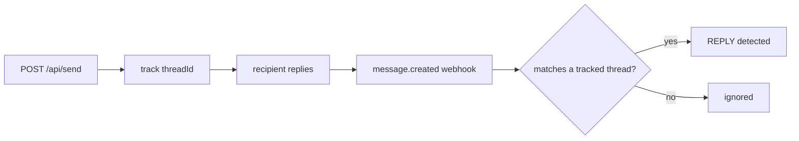

# Nylas Email API Demo

A working Node/Express reference for the Nylas v3 Email API: connect a mailbox,
send mail with attachments and signatures, and get notified when someone replies on
the thread.

Two things live here:

1. **A runnable demo** — visit a page, connect your email, send a message, watch the
   reply land over a webhook.
2. **A docs library** ([`docs/`](docs/)) built for coding agents, so you can point one
   at this repo when adding email to another codebase.

Agents: start at [`AGENTS.md`](AGENTS.md), then [`docs/README.md`](docs/README.md).

## Quick start

```bash
npm install
cp .env.example .env
npm run dev
```

Open http://localhost:3000.

The server runs with no credentials — it just tells you what is missing. To do
anything with a real mailbox, fill in `.env`:

| Variable | Where it comes from | Needed for |
| --- | --- | --- |
| `NYLAS_API_KEY` | Dashboard → your app → API Keys | every API call |
| `NYLAS_CLIENT_ID` | Dashboard → your app → Overview | the connect flow |
| `NYLAS_CALLBACK_URI` | must be registered on the app | the connect flow |
| `NYLAS_WEBHOOK_SECRET` | returned when you create a webhook | verifying notifications |

`NYLAS_CLIENT_ID` is a different value from the API key, and the callback URI has to
match what is registered in the dashboard character for character.

## What it does

### Connect a mailbox

Hosted OAuth. `/auth/connect` redirects to the provider, `/oauth/callback` exchanges
the one-time code for a grant, and the grant ID is written to `.data/grants.json`.
Disconnecting deletes the grant.

The connect flow is CSRF-guarded with an OAuth `state` value.

### Send email

`POST /api/send` accepts multipart, so the browser form can attach a PDF. It supports
stored signatures (applied server-side by Nylas), open and link tracking, and sends
with an idempotency key so a double-submit does not send twice.

### Detect replies

The half worth studying. On send, the `threadId` is written down. When
`message.created` arrives, the handler works out whether the message is our own send,
an out-of-office autoresponder, or a real reply on a thread we started — and only the
last one counts.



## Endpoints

| Method | Path | Purpose |
| --- | --- | --- |
| GET | `/` | The demo UI |
| GET | `/auth/connect` | Start hosted OAuth |
| GET | `/oauth/callback` | Exchange the code for a grant |
| POST | `/auth/disconnect` | Delete the grant |
| GET | `/api/grant` | Connection state |
| POST | `/api/send` | Send (multipart or JSON) |
| POST | `/api/reply` | Reply within a thread |
| GET | `/api/messages` | List messages |
| GET | `/api/threads` | Threads this app has sent on |
| GET | `/api/threads/:id` | One thread with message bodies |
| GET | `/api/signatures` | List stored signatures |
| POST | `/api/signatures` | Create one |
| GET | `/api/events/stream` | Live activity over SSE |
| GET | `/webhooks/nylas` | Challenge handshake |
| POST | `/webhooks/nylas` | Notification delivery |
| GET | `/health` | `{ ok: true }` |

## Receiving real webhooks

Nylas delivers only to public HTTPS, and **blocks ngrok**. Use cloudflared:

```bash
cloudflared tunnel --url http://localhost:3000
npm run webhook:create -- https://your-tunnel.trycloudflare.com
```

Put the returned secret in `.env` as `NYLAS_WEBHOOK_SECRET` and restart. Full walkthrough:
[`docs/recipes/local-webhook-tunnel.md`](docs/recipes/local-webhook-tunnel.md).

## Testing without credentials

The webhook path works offline:

```bash
curl "http://localhost:3000/webhooks/nylas?challenge=test123"    # -> test123
```

With `NYLAS_WEBHOOK_SECRET=test_secret_123` set, sign a payload yourself and the real
verification path runs — see the snippet in the tunnel recipe.

## Scripts

| Command | Purpose |
| --- | --- |
| `npm run dev` | Start with hot reload |
| `npm run grants` | List grants and webhooks — first stop when nothing arrives |
| `npm run webhook:create -- <https-url>` | Register the webhook endpoint |
| `npm run send:test -- <email> [file.pdf]` | Send a real test email |
| `npm run docs:fetch` | Refresh the vendored docs |

## Layout

```
src/
  Nylas.js          every Nylas call
  server.js         express wiring, raw-body capture
  config.js         the only module that reads process.env
  store.js          grant + tracked threads (JSON file)
  events.js         in-memory feed, fanned out over SSE
  routes/           auth, webhooks, email
  public/           the UI, no build step
docs/
  README.md         index: intent -> page
  recipes/          task-oriented guides
  reference/        vendored official docs
scripts/            operational helpers
```

## Notes on the implementation

- **The grant store is a JSON file** so the demo runs with no database. In a real app
  the grant ID belongs on a user record, and tracked threads belong in a table you can
  query by thread ID.
- **Raw request bytes are captured** in `express.json({ verify })` because the webhook
  signature is an HMAC over exactly what Nylas sent. Re-serializing the parsed JSON
  breaks verification.
- **The webhook acks before doing work.** Nylas allows 10 seconds and retries three
  times on anything that is not a `200`.
- **Signatures are applied by Nylas**, not concatenated into the body, so they stay
  out of your content and can be swapped per send.
