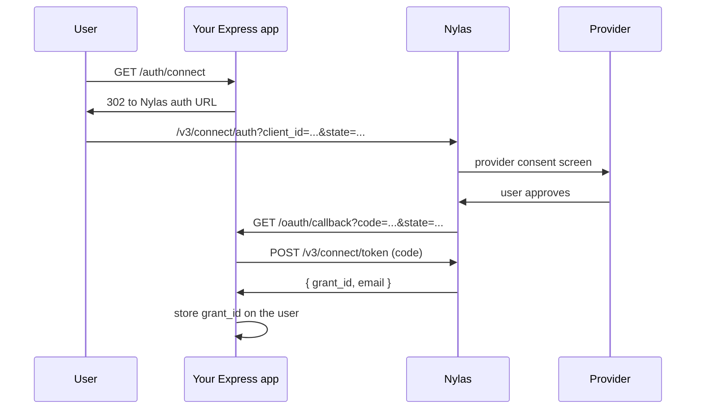

# Connect a mailbox

Getting a `grant_id` for a user's mailbox. Nothing else in the Email API works
without one.

Working code: [`src/routes/auth.js`](../../src/routes/auth.js).

## Which auth method

| Situation | Use |
| --- | --- |
| A person will click a button in a browser | **Hosted OAuth** — this page |
| Your app already has an IDP (Auth0, Clerk, Okta) and a browser frontend | [Nylas Connect](../reference/nylas-connect.md) |
| An autonomous agent needs its own mailbox, no human | Agent Accounts (`POST /v3/connect/custom`) |
| You already hold provider OAuth tokens | Bring Your Own Auth |

Nylas Connect is a **client-side** SDK. It is not a server-side flow and it needs a
third-party identity provider. For an Express app doing its own connect flow, use
hosted OAuth.

## Prerequisites

Three values, all from the Nylas dashboard:

- `NYLAS_API_KEY` — application API key
- `NYLAS_CLIENT_ID` — the application's client ID, a **different value** from the API key
- A callback URI registered on the application, matching your `redirect_uri` exactly

The callback URI comparison is character-for-character. A trailing slash, `http` vs
`https`, or a different port all cause Nylas to reject the authorization request.

## The flow



## Step 1: send the user to Nylas

```js
import Nylas from "nylas";

const nylas = new Nylas({ apiKey: process.env.NYLAS_API_KEY });

app.get("/auth/connect", (req, res) => {
    const url = nylas.auth.urlForOAuth2({
        clientId: process.env.NYLAS_CLIENT_ID,
        redirectUri: process.env.NYLAS_CALLBACK_URI,
        provider: "google",       // omit to let Nylas show a provider picker
        state: issueState(),      // CSRF guard, see below
    });

    res.redirect(url);
});
```

`state` is returned to you unmodified. Generate it, remember it, and reject any
callback carrying a value you did not issue — otherwise anyone can POST a code to
your callback. It is also the natural place to carry your own user ID through the
flow, since the callback is otherwise anonymous.

## Step 2: exchange the code

```js
app.get("/oauth/callback", async (req, res) => {
    const { code, state } = req.query;

    if (!claimState(state)) return res.status(400).send("Invalid state");

    const { grantId, email } = await nylas.auth.exchangeCodeForToken({
        clientId: process.env.NYLAS_CLIENT_ID,
        redirectUri: process.env.NYLAS_CALLBACK_URI,
        code,
    });

    await db.users.update(req.session.userId, { nylasGrantId: grantId, email });
    res.redirect("/");
});
```

**The code is single-use.** If the exchange fails, restart the whole flow. Retrying
with the same code returns an error.

You do not store the access token. Nylas keeps whatever it needs on the grant record;
the `grant_id` is the only thing your app needs to persist.

## Step 3: disconnect

```js
await nylas.grants.destroy({ grantId });
```

This is permanent and drops everything Nylas synced for the mailbox.

**Do not call this to fix an auth error.** An expired or invalid grant is repaired by
sending the user back through the OAuth flow, which refreshes the existing grant and
keeps its data. Deleting and recreating loses it.

## Grant lifecycle

Grants go invalid when a user revokes access, changes their password, or the provider
token expires. Two ways to find out:

- A `401` on any API call using that grant.
- The `grant.expired` webhook, which is the one that lets you react before the user
  notices.

Either way the fix is re-authentication, not deletion.

## Troubleshooting

| Symptom | Cause |
| --- | --- |
| `redirect_uri` mismatch | The URI is not registered on the application, or differs by a character |
| Google consent screen appears twice | Normal — Google splits scope approval across two screens |
| Callback arrives with `error=access_denied` | User declined; no grant was created |
| Exchange returns "code already used" | The code is single-use; restart the flow |
| Grant exists but calls 404 | Wrong region — a US grant is invisible to `api.eu.nylas.com` |

## Reference

- [auth.md](../reference/auth.md)
- [auth-hosted-oauth-apikey.md](../reference/auth-hosted-oauth-apikey.md)
- [nylas-connect.md](../reference/nylas-connect.md)
