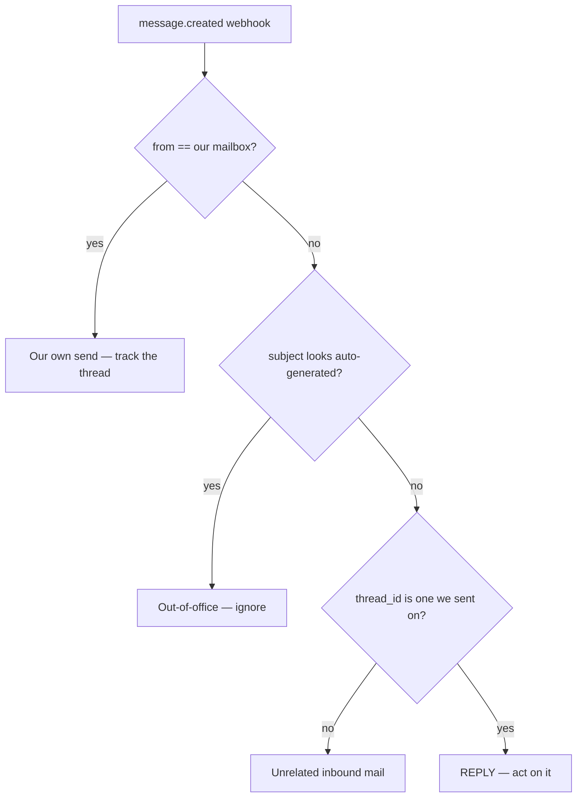

# Get notified when someone replies

The pattern for "I sent an email to a contact and I want to know when they reply on
that thread."

Working code: [`src/routes/webhooks.js`](../../src/routes/webhooks.js) and
[`src/store.js`](../../src/store.js).

## How it works

Webhooks, not polling. `message.created` fires within seconds of mail arriving, and
its payload carries `thread_id` — so matching a reply to a conversation needs no
header parsing.

The catch is that `message.created` fires for **your own sends too**. The work is
almost entirely in telling the directions apart.



## Step 1: record the thread when you send

You cannot recognize a reply to a conversation you did not write down.

```js
const sent = await nylas.messages.send({ identifier: grantId, requestBody: {...} });

await db.threads.upsert({
    threadId: sent.data.threadId,     // the key inbound mail is matched on
    messageId: sent.data.id,
    contactId,
    subject,
});
```

## Step 2: subscribe

```bash
curl -X POST 'https://api.us.nylas.com/v3/webhooks/' \
  -H 'Authorization: Bearer <NYLAS_API_KEY>' \
  -H 'Content-Type: application/json' \
  -d '{
    "trigger_types": ["message.created", "message.send_success", "message.send_failed"],
    "webhook_url": "https://your-app.com/webhooks/nylas",
    "description": "reply detection"
  }'
```

Or `npm run webhook:create -- https://your-tunnel-url` in this repo.

## Step 3: handle the notification

```js
app.post("/webhooks/nylas", (req, res) => {
    // Ack first. Nylas allows 10 seconds and retries on anything but a 200.
    res.status(200).send();

    const message = req.body?.data?.object ?? {};
    handleInbound(message).catch((err) => console.error(err));
});

async function handleInbound(message) {
    const sender = message.from?.[0]?.email;
    if (!sender) return;

    // Our own send echoing back. Record the thread; it is not a reply.
    if (sender.toLowerCase() === ourMailbox.toLowerCase()) {
        return db.threads.upsert({ threadId: message.thread_id, messageId: message.id });
    }

    if (AUTO_REPLY_RE.test(message.subject ?? "")) return;

    const tracked = await db.threads.findByThreadId(message.thread_id);
    if (!tracked) return;                  // unrelated inbound mail

    await onReply(tracked, message);       // stop the sequence, tag the contact, etc.
}
```

Note the field casing: webhook payloads come straight from Nylas as **snake_case**
(`thread_id`), while Node SDK responses are camelCased (`threadId`). Mixing them up
produces `undefined` rather than an error.

## Filtering out the noise

```js
const AUTO_REPLY_RE =
    /^\s*(re:\s*)?(automatic reply|auto(matic)?[- ]?response|out of (the )?office|undeliverable|delivery status notification)/i;
```

Out-of-office autoresponders arrive as genuine inbound messages on the right thread.
Without this check they read as replies and stop sequences that should keep running.

## Delivery guarantees

Nylas guarantees **at least once**, so duplicates happen — Google and Microsoft both
send upserts. Make handlers idempotent by keying on `message.id`:

```js
if (await db.processed.has(message.id)) return;
await db.processed.add(message.id);
```

Other properties worth designing around:

- Non-`200` responses are retried 3 times total, with the last attempt 10–20 minutes
  after the first.
- 95% failures over 15 minutes marks the endpoint `failing`; over 72 hours marks it
  `failed`. A `failed` endpoint is never automatically reactivated, and events that
  occurred while it was failed are **not** replayed.
- New grants can take up to two minutes before their notifications start flowing.

## Payload suffixes

Nylas appends suffixes when it alters the payload, and they combine —
`message.created.cleaned.truncated` is a real trigger type. Match on the base name
and read the flags separately.

| Suffix | Meaning |
| --- | --- |
| `.truncated` | Payload passed 1MB; body stripped. Re-query the message |
| `.transformed` | Dashboard field customization is on |
| `.cleaned` | Clean Conversations output; `body` is markdown |
| `.metadata` | Google grant limited to the `gmail.metadata` scope |

`Nylas.parseTriggerType()` in [`src/Nylas.js`](../../src/Nylas.js) does this parsing.

## Verify the signature

```js
const expected = crypto
    .createHmac("sha256", process.env.NYLAS_WEBHOOK_SECRET)
    .update(req.rawBody)                    // raw bytes, not the parsed object
    .digest("hex");
```

Capture the raw body before parsing:

```js
app.use(express.json({ verify: (req, _res, buf) => { req.rawBody = buf; } }));
```

Re-serializing parsed JSON changes the bytes and verification fails. On a gzipped
delivery, verify against the compressed body *before* decompressing.

## Related triggers

| Trigger | Fires when |
| --- | --- |
| `message.created` | Mail arrives — inbound or your own send |
| `message.send_success` / `message.send_failed` | The provider accepted or rejected your send |
| `message.opened` / `message.link_clicked` | Requires `trackingOptions` on the send |
| `message.bounced` | Delivery bounced |
| `grant.expired` | The user must re-authenticate |

## Reference

- [notifications.md](../reference/notifications.md)
- [email-threads.md](../reference/email-threads.md)
